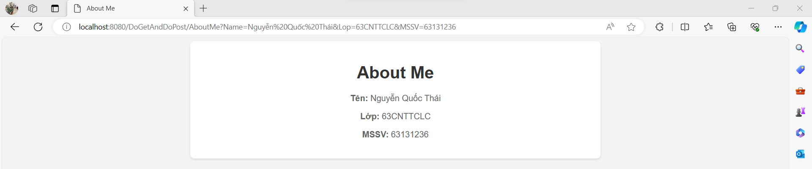
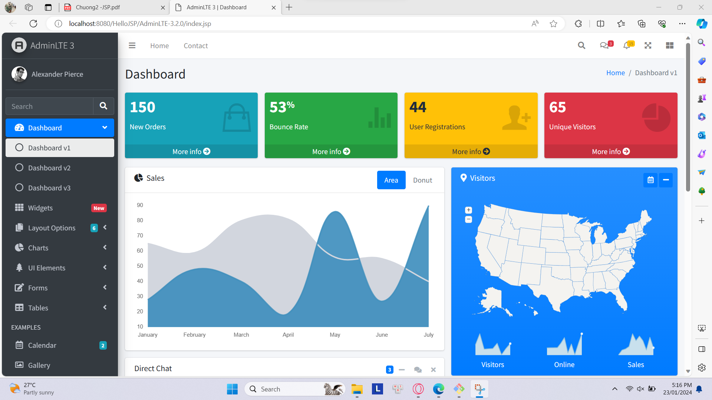
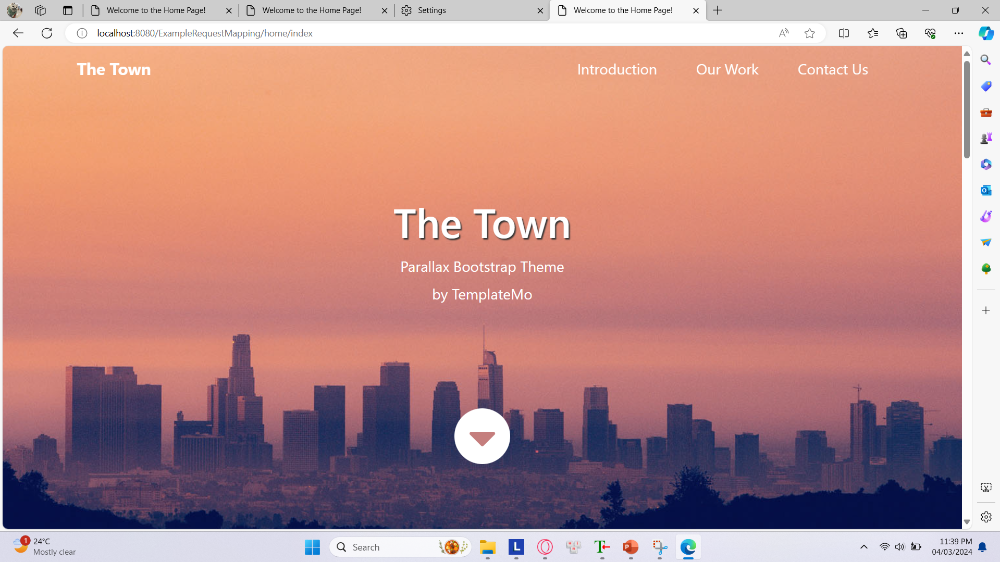

# Bài Tập Web 2 - Phát triển ứng dụng Web 2

> Sinh viên: Nguyễn Quốc Thái - 63.CNTT.CLC-1

## Cài Đặt:

- Eclipse
- JDK Version 11 hoặc mới hơn
- Apache Tomcat Server

**_Quá trình thực hiện bài tập_**

### Bài 1: Các ví dụ 1.1, 1.2, 1.3, 1.4

#### [Chi tiết bài tập](https://github.com/GunterWi/63131236_Web2/tree/main/DoGetAndDoPost)

### Bài 2: Các ví dụ 2.1, 2.2, 2.3, trang admin

#### [Chi tiết bài tập](https://github.com/GunterWi/63131236_Web2/tree/main/HelloJSP)

### Bài 3: Các ví dụ sử dụng RequestMapping

#### [Chi tiết bài tập](https://github.com/GunterWi/63131236_Web2/tree/main/ExampleRequestMapping)

